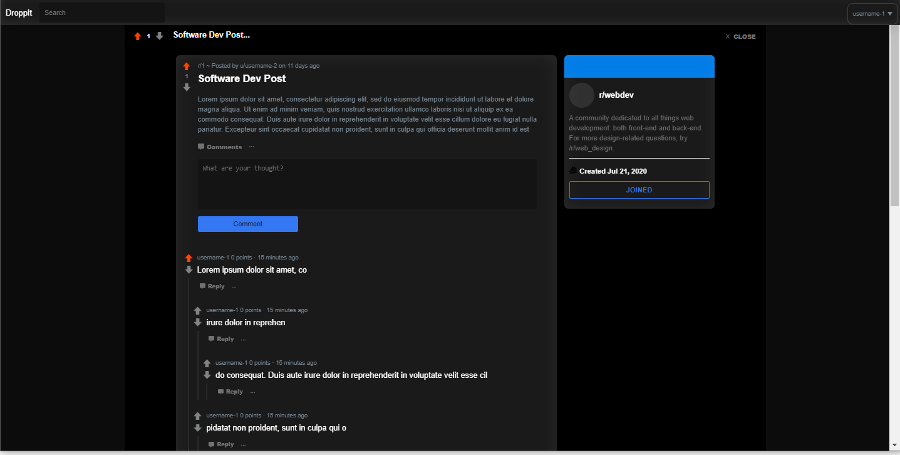
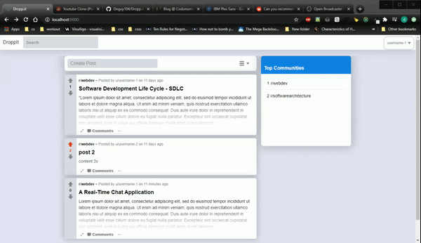
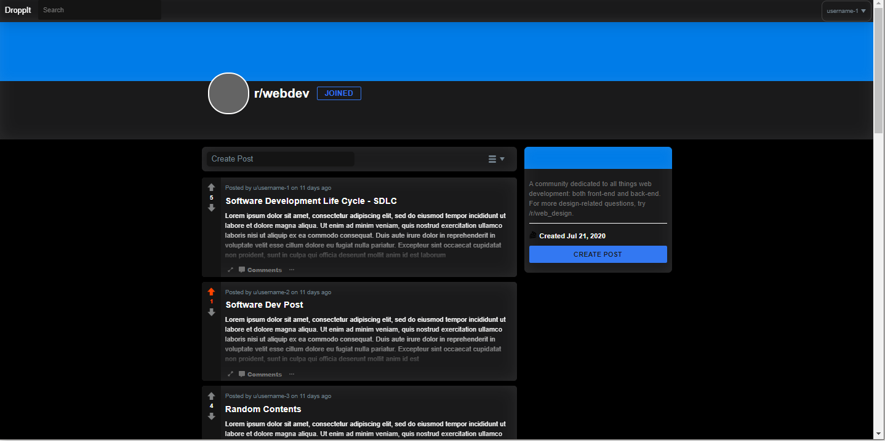
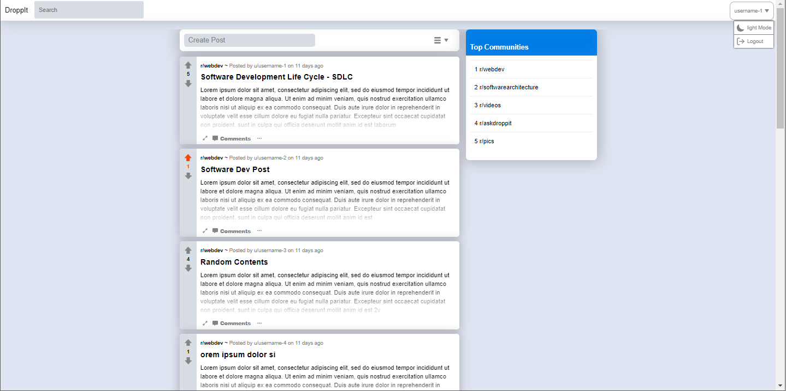

# Dropp.it

A fullstack community forum content application (inspired by Reddit). Users can create communities where they can post content, comment, and vote.  
Frontend -  React.js, Redux  
Backend - Python, Django, MySQL  

## Features
* User accounts with JWT token based authentication
* Psistent toggleable UI themes
* flexible/ responsive UI
* CSS sprite icons
* Infinite scrolling
* collapsable threaded comments
* Forum subscriptions and posting comments
* Upvote/downvote content

## To be Implemented
* Media content support (images/videos)

## To Run
For frontend dev server, In root directory run:  
>npm run start

For API Server, In Proj directory run:  
>python manage.py runserver
